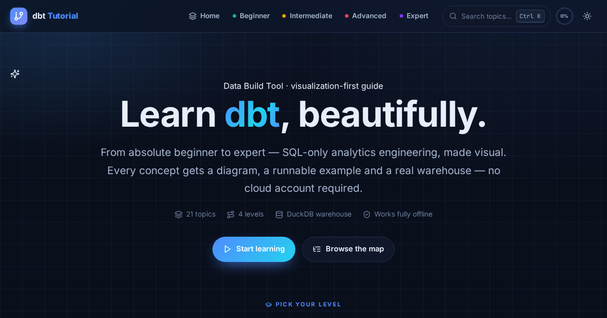

# dbt Complete Tutorial

A visual, hands-on guide to **dbt** — from absolute beginner to expert. Twenty-one
topic pages across four levels, built as a fully static, offline-capable website
with real SVG diagrams, syntax highlighting, progress tracking and a light/dark
theme. Built around **DuckDB** so every example runs locally with no cloud account.

**▶ Live tutorial — <https://malikb0.github.io/dbt-guide-tutorial>**

[](https://malikb0.github.io/dbt-guide-tutorial)
[](https://www.getdbt.com/)
[](https://duckdb.org/)
[](https://nodejs.org/)
[](#design)
[](#getting-started)
[](.github/workflows/ci.yml)
[](.github/workflows/pages.yml)
[](LICENSE-CONTENT)
[](LICENSE-CODE)



## Contents

- [What's in here](#whats-in-here)
- [Curriculum](#curriculum)
- [Prerequisites](#prerequisites)
- [Getting started](#getting-started)
- [Scripts](#scripts)
- [Editing content](#editing-content)
- [Design](#design)
- [Accuracy](#accuracy)
- [Deploying](#deploying)
- [Troubleshooting](#troubleshooting)
- [Contributing](#contributing)
- [License](#license)

## What's in here

| Path | Purpose |
|------|---------|
| `index.html` | Home — level picker, all topics, quick-jump map *(generated)* |
| `<level>/index.html` | Level hub for `beginner`, `intermediate`, `advanced`, `expert` *(generated)* |
| `<level>/<slug>.html` | The 21 topic pages *(generated)* |
| `content/<level>/<slug>.html` | **Source** — the body prose for each topic |
| `data/topics.mjs` | **Single source of truth**: site meta, levels, topics, per-topic metadata |
| `templates/layout.mjs` | Page shell: head, header, hero, TOC rail, pager, footer |
| `templates/diagrams.mjs` | Inline, theme-aware SVG diagram library |
| `tools/build.mjs` | Static site generator (composes data + fragments + templates) |
| `tools/vendor-assets.mjs` | Copies fonts/Prism/icons from `node_modules` into `assets/` |
| `tools/check.mjs` | Integrity checks: links, anchors, icons, duplicates, placeholders |
| `tools/stage.mjs` | Assembles a clean `_site/` for deployment (used by the Pages workflow) |
| `css/style.css` | The whole design system |
| `assets/js/app.js` | Runtime: theme, nav, progress, copy, TOC scrollspy, search, quizzes |
| `assets/` | Vendored fonts (Inter, JetBrains Mono), Prism, icon sprite, OG image |
| `docs/AUTHORING.md` | The content/component contract for writing a topic page |
| `.github/workflows/` | CI (`ci.yml`) and GitHub Pages deployment (`pages.yml`) |
| `licenses/` | Full license texts for the bundled fonts, Prism and Lucide |

## Curriculum

21 topics · four levels · every page ends with key takeaways and a quiz.

<details>
<summary><strong>🚀 Beginner — Foundations</strong> · 6 topics · ~2.5 h</summary>

- [What is dbt? Why use it?](beginner/1-intro.html) — 15 min
- [Setup & Installation](beginner/2-installation.html) — 30 min
- [Core Concepts: Models, Sources & Seeds](beginner/3-core-concepts.html) — 25 min
- [Your First dbt Model](beginner/4-your-first-model.html) — 30 min
- [Seeds & Sources Explained](beginner/5-seeds-and-sources.html) — 20 min
- [Basic Tests (NOT NULL, UNIQUE)](beginner/6-basic-tests.html) — 15 min
</details>

<details>
<summary><strong>🔧 Intermediate — Level Up</strong> · 7 topics · ~4 h</summary>

- [Materializations: View, Table & Incremental](intermediate/1-concepts.html) — 20 min
- [Macros & Jinja Templating](intermediate/2-macros-jinja.html) — 35 min
- [Refining Tests with dbt_utils](intermediate/3-tests-refine.html) — 15 min
- [Snapshots for SCD Type 2](intermediate/4-snapshots.html) — 20 min
- [CI/CD Pipelines Overview](intermediate/5-ci-cd.html) — 15 min
- [Query Optimization & Caching](intermediate/6-performance.html) — 20 min
- [Exposures: Tracking Business Metrics](intermediate/7-exposures.html) — 15 min
</details>

<details>
<summary><strong>🔥 Advanced — Go Deep</strong> · 4 topics · ~3 h</summary>

- [Source Discovery & Lineage](advanced/1-sources.html) — 30 min
- [Advanced Macro Patterns](advanced/2-macros-advanced.html) — 25 min
- [CI/CD with GitHub Actions](advanced/3-ci-cd-github-actions.html) — 20 min
- [Performance Tuning at Scale](advanced/4-performance-optimization.html) — 15 min
</details>

<details>
<summary><strong>👑 Expert — Master Class</strong> · 4 topics · ~3.5 h</summary>

- [Custom Materializations & Build Hooks](expert/1-materializations.html) — 30 min
- [CI/CD Deployment Pipelines](expert/2-ci-cd-deploy.html) — 25 min
- [Expert-Level Query Optimization](expert/3-performance-expert.html) — 30 min
- [Best Practices & Patterns](expert/4-best-practices.html) — 20 min
</details>

## Prerequisites

| To… | You need |
|-----|----------|
| **Read the tutorial** | Any modern browser — the committed HTML runs offline, no install |
| **Rebuild after editing** | [Node.js](https://nodejs.org/) 18+ and npm |
| **Run `npm run serve`** | Python 3 for the built-in server, or use `npx serve` instead (see [Troubleshooting](#troubleshooting)) |

## Getting started

The **generated HTML is committed**, so the fastest path needs nothing but a
browser:

```bash
open index.html          # macOS
# xdg-open index.html    # Linux
```

That works with no server, no build and no internet, because every asset is
relative and vendored locally.

### Run it through npm

With Node 18+ you can drive everything with the bundled scripts:

```bash
npm install              # first time only — installs the dev deps used to vendor assets
npm run serve            # preview at http://localhost:8000
```

`npm run serve` starts a tiny static server (`python3 -m http.server`) so the
search palette, progress tracking and relative links behave exactly as they
would in production.

## Scripts

| Script | Runs | What it does |
|--------|------|--------------|
| `npm run serve` | `python3 -m http.server 8000` | Preview the site at <http://localhost:8000> |
| `npm run build` | `node tools/build.mjs` | Regenerate all HTML from `data/`, `content/`, `templates/` |
| `npm run verify` | `build` + `check` | Rebuild, then run every integrity check |
| `npm run check` | `node tools/check.mjs` | Validate links, anchors, icons, duplicate ids, placeholders |
| `npm run assets` | `node tools/vendor-assets.mjs` | Re-vendor fonts, Prism and the icon sprite from `node_modules` |
| `npm run stage` | `build` + `tools/stage.mjs` | Build, then assemble a clean deployable copy in `_site/` |
| `npm run clean` | `node tools/build.mjs --clean` | Delete generated HTML/helpers, leave all sources intact |

**Typical loop**

```bash
npm install          # once
npm run serve        # in one terminal
npm run verify       # after editing content/ or data/
```

Vendored assets already live in `assets/`; re-run `npm run assets` only if you
update the dev dependencies. Opening files directly with `file://` also works,
since everything is relative and offline.

## Editing content

A topic fragment is plain HTML — no `<!DOCTYPE>`, no head, no nav. The build wraps
it with the shared shell and turns `<h2>`/`<h3>` into TOC entries with anchor links.

```html
<p class="lead">One-sentence framing of the lesson.</p>

<h2>A section</h2>
<p>Explanation…</p>

{{diagram:materializations|How dbt persists a model.}}

<div class="callout callout--tip">
  <div class="callout__icon">{{icon:lightbulb}}</div>
  <div><div class="callout__title">Tip</div><p>Useful note.</p></div>
</div>
```

`{{diagram:key}}` and `{{icon:name}}` are resolved at build time.

- **Full component contract** (callouts, cards, steps, tabs, tables, try-it boxes,
  quizzes, available diagram keys and icons): [`docs/AUTHORING.md`](docs/AUTHORING.md).
- **Reference implementation**: [`content/beginner/1-intro.html`](content/beginner/1-intro.html).
- To add or reorder topics, edit [`data/topics.mjs`](data/topics.mjs) — it drives
  the nav, home page, level hubs, sitemap and search index.

After any edit, run `npm run verify`. It fails on broken links, unknown icons,
unknown diagram keys, duplicate ids and leftover `{{…}}` placeholders.

## Design

- **Dark "data-lab" theme by default**, with a light theme toggle; the choice is
  persisted in `localStorage` and honours `prefers-color-scheme`.
- Per-level accent colours (emerald → amber → red → violet) applied via
  `data-level` on `<body>`.
- Every diagram is inline SVG using CSS custom properties, so it re-themes live.
- Content is visible by default; animations are a progressive enhancement.
- Respects `prefers-reduced-motion`; includes a print stylesheet.

## Accuracy

The content targets **dbt 1.8+** with the DuckDB adapter. Where behaviour is
adapter-specific (partitioning, incremental strategies) or version-specific
(microbatch, freshness syntax), the pages say so explicitly. Corrections made
during the rewrite include the incremental `is_incremental()` filter (user-written,
never auto-injected), `dbt init` project creation, and DuckDB `profiles.yml` setup.

## Deploying

The site is a plain static folder, so it hosts anywhere — but it's set up for
**GitHub Pages out of the box**.

### GitHub Pages (Actions, recommended)

1. Push the repo to GitHub (`main` branch).
2. Settings → Pages → **Build and deployment → Source: GitHub Actions**.
3. Push to `main` (or run the **Deploy to GitHub Pages** workflow manually).

`.github/workflows/pages.yml` runs `npm run verify`, stages a clean `_site/`
(HTML + `css/` + `assets/` only), and deploys it. It injects the correct
**`SITE_URL`** from the Pages URL, so `<link rel="canonical">`, `og:url`,
`og:image` and `sitemap.xml` all become absolute automatically.

### GitHub Pages (branch, no CI)

Prefer zero Actions? Settings → Pages → *Deploy from a branch*, folder `/`. The
generated HTML is committed, so the root serves directly. The committed
`.nojekyll` stops Jekyll from processing the site. In this mode set your domain
once in `data/topics.mjs` (`SITE.url`) and run `npm run build` so the canonical
and sitemap URLs are absolute.

### Other hosts

| Host | Setting |
|------|---------|
| **Netlify / Vercel / Cloudflare Pages** | Build command `npm run stage`, publish directory `_site` |
| **Any web server / object store** | Upload `_site/` (or the repo root) — only `css/`, `assets/` and the `.html` files are needed at runtime |

`content/`, `data/`, `templates/`, `tools/`, `docs/` and `node_modules/` are
build-time only and are excluded from `_site/`.

### URL / SEO configuration

`SITE.url` in [`data/topics.mjs`](data/topics.mjs) is the single knob. It defaults
to this project's Pages URL
(`https://malikb0.github.io/dbt-guide-tutorial`); override it without editing code:

```bash
SITE_URL=https://example.com/ npm run build
```

The Pages workflow sets this for you. If you serve from a subpath, keep the
trailing slash off — the build normalises it.

## Troubleshooting

| Symptom | Fix |
|---------|-----|
| `npm run serve` fails with "python3: command not found" | Run `npx serve .` (or `npx http-server .`) instead, or open `index.html` directly |
| `npm install` fails or `npm run build` says "Cannot find module" | Check `node --version` is 18+; delete `node_modules` and re-run `npm install` |
| Pages look stale after editing | Run `npm run build` (or `npm run verify`) — the browser reads generated HTML, not `content/` directly |
| `npm run check` reports a broken link or unknown icon | The message names the file and token; fix it in `content/…` or `data/topics.mjs`, then re-run |
| I want to start over from sources | `npm run clean` removes generated output, then `npm run build` regenerates it |

## Contributing

See [CONTRIBUTING.md](CONTRIBUTING.md) and the authoring contract
[`docs/AUTHORING.md`](docs/AUTHORING.md). CI runs `npm run verify` on every pull
request; changes must edit sources and regenerate the committed HTML in the same
commit.

## License

**© 2026 Malik Awais. All rights reserved.** The project is **dual-licensed**
(see [LICENSE](LICENSE)):

| Part | License |
|------|---------|
| **Tutorial content** — lessons, prose, diagrams, quizzes, examples | [CC BY-NC-ND 4.0](LICENSE-CONTENT) |
| **Build & site code** — `tools/`, `templates/`, `assets/js/`, `css/` | [MIT](LICENSE-CODE) |

For the **content**, in plain language:

| You may | You may not |
|---------|-------------|
| Read, learn from, and use the material yourself | Use it commercially or to sell a product/course |
| Link to it and quote from it **with clear credit** to this project | Republish or redistribute it as a whole |
| Share **unmodified** copies with attribution | Publish modified, adapted, translated or rebranded versions |
| | Present it as your own work or imply endorsement |

Attribution should name **"dbt Complete Tutorial"** and link back to this
repository. Want to use it beyond these terms (e.g. in a paid course)? Open an
issue to ask for permission — I'm happy to grant it case by case.

The **code** is ordinary MIT-licensed software. Bundled fonts (Inter, JetBrains
Mono), Prism.js and Lucide icons keep their own permissive licenses and are
covered by neither of the above; full texts and attribution are in
[THIRD-PARTY-LICENSES.md](THIRD-PARTY-LICENSES.md).

This is an independent educational resource, **not affiliated with or endorsed by
dbt Labs or DuckDB Labs**. "dbt", "DuckDB" and other names are trademarks of their
respective owners.
